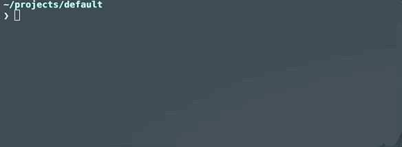
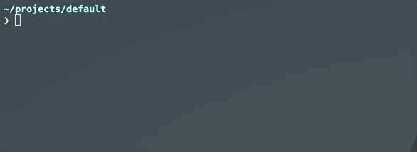

---
tags:
  - v3
search:
  boost: 2
---

The urfave/cli v3 library supports programmable completion for apps utilizing its framework. This means
that the completion is generated dynamically at runtime by invoking the app itself with a special hidden
first argument, `__complete`, followed by the words typed so far and, as the last argument, the word being
completed. The urfave/cli searches for that argument and activates a different flow for command paths than
regular flow.
The following shells are supported

 - bash
 - zsh
 - fish
 - powershell

Enabling auto complete requires 2 things

 - Setting the `EnableShellCompletion` field on root `Command` object to `true`. 
 - Sourcing the completion script for that particular shell. 

The completion script for a particular shell can be retrieved by running the "completion" subcommand
on the app after the `EnableShellCompletion` field on root `Command` object has been set to `true`. 

Consider the following program

```go
package main

import (
	"fmt"
	"log"
	"os"
	"context"

	"github.com/urfave/cli/v3"
)

func main() {
	cmd := &cli.Command{
		Name: "greet",
		EnableShellCompletion: true,
		Commands: []*cli.Command{
			{
				Name:    "add",
				Aliases: []string{"a"},
				Usage:   "add a task to the list",
				Action: func(ctx context.Context, cmd *cli.Command) error {
					fmt.Println("added task: ", cmd.Args().First())
					return nil
				},
			},
			{
				Name:    "complete",
				Aliases: []string{"c"},
				Usage:   "complete a task on the list",
				Action: func(ctx context.Context, cmd *cli.Command) error {
					fmt.Println("completed task: ", cmd.Args().First())
					return nil
				},
			},
			{
				Name:    "template",
				Aliases: []string{"t"},
				Usage:   "options for task templates",
				Commands: []*cli.Command{
					{
						Name:  "add",
						Usage: "add a new template",
						Action: func(ctx context.Context, cmd *cli.Command) error {
							fmt.Println("new task template: ", cmd.Args().First())
							return nil
						},
					},
					{
						Name:  "remove",
						Usage: "remove an existing template",
						Action: func(ctx context.Context, cmd *cli.Command) error {
							fmt.Println("removed task template: ", cmd.Args().First())
							return nil
						},
					},
				},
			},
		},
	}

	if err := cmd.Run(context.Background(), os.Args); err != nil {
		log.Fatal(err)
	}
}
```

After compiling this app as `greet` we can generate the autocompletion as following
in bash script

```sh-session
$ greet completion bash
```

This file can be saved to /etc/bash_completion.d/greet or $HOME/.bash_completion.d/greet
where it will be automatically picked in new bash shells. For the current shell these
can be sourced either using filename or from generation command directly

```sh-session
$ source ~/.bash_completion.d/greet
```

```sh-session
$ source <(greet completion bash)
```

The procedure for other shells is similar to bash though the specific paths for each of the 
shells may vary. Some of the sections below detail the setup need for other shells as
well as examples in those shells.

#### `__complete` is reserved

Setting `EnableShellCompletion` reserves `__complete` as the first argument of your app: a run
starting with it is answered as a completion request rather than passed on, and the words after it
are read as the command line being completed. An app that takes free-form positional arguments
therefore cannot receive `__complete` as its first one. An app that declares a command of that name
keeps it, and stops being completable in exchange.

#### Nothing is completed after a `--`

The words after a `--` are positional arguments of whatever your app runs with them, so urfave/cli
answers a request for one with no candidates and does not run your `ShellComplete` at all. A command
that wraps another one therefore cannot hand its completions on: `myapp exec -- git pu<TAB>` offers
nothing rather than what `git` would offer. What it does do is leave your app's action alone, which
is what a shell asking for completions needs.

#### Regenerate the script after upgrading

Completion scripts generated before urfave/cli asked for completions with `__complete` end their request
with a `--generate-shell-completion` flag instead. Those scripts keep working, but a command line holding
a `--` cannot be answered through them: after `--` only positional arguments are accepted, so the flag
belongs to whatever the app runs rather than to the app itself, and the app runs instead of completing
(see [#1932](https://github.com/urfave/cli/issues/1932) and
[#1993](https://github.com/urfave/cli/issues/1993)). Regenerating the script and sourcing it again is what
resolves that: `__complete` is the first argument, where a `--` typed later on the command line can no
longer turn it into a positional argument.

Until the script is regenerated, pressing tab on such a line runs your app. Nothing rejects the
request: after a `--` the flag is a positional argument, so it is passed to your action along with
everything else on the line and the run completes as though you had pressed enter. Declaring how
many arguments a command takes does not stop it either, since an argument too many is not an error
here; only your own action can turn it down. A command that
passes its arguments on hands the flag to what it runs, which is what makes it the right reading for
a wrapper, and the wrong one for a tab key. Regenerating the script is what separates the two.

#### Default auto-completion

```go
package main

import (
	"fmt"
	"log"
	"os"
	"context"

	"github.com/urfave/cli/v3"
)

func main() {
	cmd := &cli.Command{
		EnableShellCompletion: true,
		Commands: []*cli.Command{
			{
				Name:    "add",
				Aliases: []string{"a"},
				Usage:   "add a task to the list",
				Action: func(ctx context.Context, cmd *cli.Command) error {
					fmt.Println("added task: ", cmd.Args().First())
					return nil
				},
			},
			{
				Name:    "complete",
				Aliases: []string{"c"},
				Usage:   "complete a task on the list",
				Action: func(ctx context.Context, cmd *cli.Command) error {
					fmt.Println("completed task: ", cmd.Args().First())
					return nil
				},
			},
			{
				Name:    "template",
				Aliases: []string{"t"},
				Usage:   "options for task templates",
				Commands: []*cli.Command{
					{
						Name:  "add",
						Usage: "add a new template",
						Action: func(ctx context.Context, cmd *cli.Command) error {
							fmt.Println("new task template: ", cmd.Args().First())
							return nil
						},
					},
					{
						Name:  "remove",
						Usage: "remove an existing template",
						Action: func(ctx context.Context, cmd *cli.Command) error {
							fmt.Println("removed task template: ", cmd.Args().First())
							return nil
						},
					},
				},
			},
		},
	}

	if err := cmd.Run(context.Background(), os.Args); err != nil {
		log.Fatal(err)
	}
}
```


#### ZSH Support

Adding the following lines to
your ZSH configuration file (usually `.zshrc`) will allow the auto-completion to
persist across new shells:

```sh-session
$ PROG=<myprogram>
$ source path/to/autocomplete/zsh_autocomplete
```

#### ZSH default auto-complete example


#### PowerShell Support

Generate the completion script as save it to `<my program>.ps1` . This file can be moved to 
anywhere in your file system.  The location of script does not matter, only the file name of the
script has to match the your program's binary name.

To activate it, enter:

```powershell
& path/to/autocomplete/<my program>.ps1
```

To persist across new shells, open the PowerShell profile (with `code $profile`
or `notepad $profile`) and add the line:

```powershell
& path/to/autocomplete/<my program>.ps1
```
